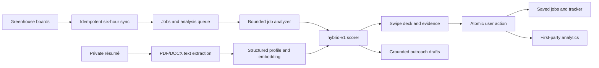

# Architecture

JobMates keeps user-facing reads behind Supabase RLS and reserves the service
key for bounded ingestion, analysis, and account deletion on the server.
Authenticated Next.js routes are dynamic, and every Supabase server client is
created inside its request.

## Trust boundaries

- The browser receives the Supabase publishable key only.
- The Supabase secret key, OpenAI key, HMAC key, and cron secret are server-only.
- Résumé objects are private and scoped by the first Storage path segment.
- AI run telemetry records model, version, token counts, duration, status, and
  safe identifiers; it does not record prompts, responses, filenames, or résumé
  text.
- Employer pages own application submission. JobMates records only user-reported
  status.

## Matching

`hybrid-v1` is a pure TypeScript function. Required skills are worth 40 points,
preferred skills 10, role semantics 15, experience 15, location 10, employment
type 5, and compensation 5. If preferred skills are absent, those 10 points move
to required skills. Unknown metadata is neutral at 0.5. Skill claims require a
canonical or stored alias match; embedding similarity cannot create a skill
match. The result is rounded once and clamped to 0–100.

`AiProvider` keeps model calls behind a stable contract. OpenAI is the supported
production adapter and the deterministic mock owns CI. An Ollama adapter is
intentionally deferred until it can meet the same structured-output, embedding,
privacy, retry, and evaluation contracts.
